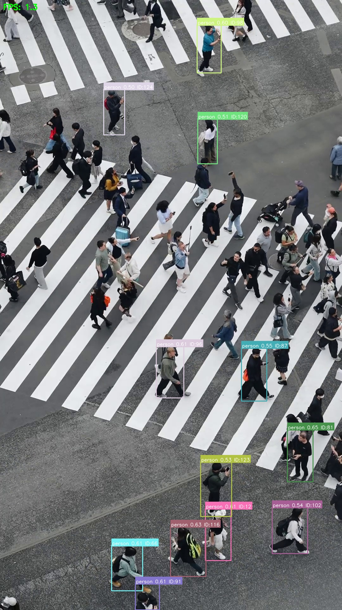

<div align="center">

# 🚀 MariaVision — Object Detection & Tracking

**Real-time object detection and multi-object tracking powered by YOLOv8**

[](https://codealphaaimariaaivision-nct7x5r5c3hhnaejrc8msi.streamlit.app/)
[](https://www.python.org/)
[](https://ultralytics.com/)
[](https://opencv.org/)
[](LICENSE)

*Portfolio project — CodeAlpha AI Internship · Task 4: Computer Vision & Deep Learning*

[Live Demo](https://codealphaaimariaaivision-nct7x5r5c3hhnaejrc8msi.streamlit.app/) · [Features](#-key-features) · [Installation](#-installation) · [Usage](#-usage-guide)

</div>

---

## 📋 Table of Contents

- [Overview](#-overview)
- [Key Features](#-key-features)
- [Technology Stack](#️-technology-stack)
- [Installation](#-installation)
- [Usage Guide](#-usage-guide)
- [Configuration](#️-configuration)
- [Performance Metrics](#-performance-metrics)
- [Project Architecture](#️-project-architecture)
- [Testing](#-testing)
- [Deployment](#-deployment)
- [License](#-license)
- [Author](#-author)

---

## 🔭 Overview

**MariaVision** is a computer vision application built for **real-time object detection** and **multi-object tracking** in video streams. It detects objects across **80+ COCO classes** and assigns **persistent tracking IDs** across frames — even in crowded scenes.

**Designed for real-world applications including:**

| Domain | Use Case |
|--------|----------|
| 👥 Crowd Monitoring | Pedestrian counting & flow analysis |
| 🚗 Traffic Analysis | Vehicle detection & tracking |
| 🏭 Industrial | Equipment & worker monitoring |
| 🏢 Retail | Customer movement analytics |

### Demo

<p align="center">
  
</p>

<p align="center"><em>Multi-person detection with bounding boxes, confidence scores, and unique tracking IDs.</em></p>

---

## ✨ Key Features

### 🎯 Detection Capabilities
- **80+ object classes** from the COCO dataset
- **Configurable confidence threshold** (0.1 – 1.0)
- **Multiple model sizes** — `yolov8n`, `s`, `m`, `l` (local) / `yolov8n.onnx` (cloud)
- **Automatic device selection** (CPU / GPU / CUDA)
- **Non-Maximum Suppression (NMS)** for clean detections

### 🔄 Tracking System
- **SORT-inspired multi-object tracking** with IOU matching
- **Persistent ID assignment** across frames
- **Occlusion handling** with configurable track lifetime
- **Optional trajectory visualization**
- **Per-track color coding**

### 🖥️ User Interface
- **Live video processing** — Webcam (local) & file upload
- **Interactive controls** — Start / Stop / Pause / Resume
- **Real-time statistics** — FPS, object counts, active tracks
- **Detection log** with timestamped events
- **Export** — Save frames & processed video
- **Responsive Streamlit dashboard**

---

## 🛠️ Technology Stack

```
┌─────────────────────────────────────────────────────────────┐
│                    USER INTERFACE LAYER                      │
│                   Streamlit Dashboard                        │
└─────────────────────────────────────────────────────────────┘
                              │
                              ▼
┌─────────────────────────────────────────────────────────────┐
│                   PROCESSING PIPELINE                        │
│  ┌─────────────┐    ┌──────────────┐    ┌───────────────┐  │
│  │   YOLOv8    │───▶│  SORT-style  │───▶│ Visualization │  │
│  │  Detection  │    │   Tracking   │    │   & Export    │  │
│  └─────────────┘    └──────────────┘    └───────────────┘  │
└─────────────────────────────────────────────────────────────┘
                              │
                              ▼
┌─────────────────────────────────────────────────────────────┐
│                     BACKEND LAYER                            │
│        OpenCV  ·  ONNX Runtime  ·  NumPy  ·  PyYAML          │
└─────────────────────────────────────────────────────────────┘
```

| Layer | Technology | Purpose |
|-------|------------|---------|
| **Detection** | YOLOv8, ONNX Runtime / Ultralytics | Object detection (80 classes) |
| **Tracking** | SORT-inspired IOU tracker | Multi-object tracking with unique IDs |
| **Vision** | OpenCV, NumPy | Image processing & video I/O |
| **Interface** | Streamlit | Interactive web dashboard |
| **Configuration** | PyYAML | Application settings |

---

## 📦 Installation

### Prerequisites

- **Python 3.9+** (3.11 recommended)
- **Webcam** (optional — local use only)
- **NVIDIA GPU + CUDA** (optional — faster local inference)

### Setup Instructions

```bash
# 1. Clone the repository
git clone https://github.com/mariabatool869-star/CodeAlpha_AI_MariaAI_Vision.git
cd CodeAlpha_AI_MariaAI_Vision

# 2. Create virtual environment
python -m venv venv

# 3. Activate environment
# Windows
venv\Scripts\activate
# macOS / Linux
source venv/bin/activate

# 4. Install dependencies
pip install -r requirements.txt

# 5. (Optional) Install local .pt model support
pip install -r requirements-dev.txt
```

> **Note:** `yolov8n.onnx` is included in the repo. For `.pt` models, install `requirements-dev.txt` — weights download automatically on first run.

### Quick Start

```bash
streamlit run app.py
```

Open **http://localhost:8501** in your browser.

---

## 📖 Usage Guide

### Step-by-Step Workflow

1. **Select Input Source**
   - **Webcam** — Real-time processing (local only)
   - **Upload Video** — `mp4`, `avi`, `mov`, `mkv`

2. **Configure Detection Settings**
   - Choose YOLOv8 model variant
   - Adjust confidence threshold
   - Toggle labels, tracking IDs, trajectories

3. **Control Processing**
   - **Start** — Begin detection & tracking
   - **Pause / Resume** — Control live processing
   - **Stop** — End session

4. **Monitor & Export**
   - View real-time statistics panel
   - Save annotated frames
   - Enable video export before starting

### Recommended Configurations

| Use Case | Model | Confidence | Notes |
|----------|-------|------------|-------|
| Real-time Webcam | `yolov8n.onnx` | 0.4 – 0.5 | Best CPU performance |
| Crowd Analysis | `yolov8s.pt` | 0.5 – 0.6 | Balanced accuracy/speed |
| Traffic Monitoring | `yolov8m.pt` | 0.6 – 0.7 | High accuracy for vehicles |
| Streamlit Cloud | `yolov8n.onnx` | 0.5 | Upload video only |

---

## ⚙️ Configuration

Edit `config.yaml` to customize default behavior:

```yaml
# Detection Configuration
model:
  name: yolov8n.onnx      # Model variant
  confidence: 0.5         # Detection threshold
  device: auto            # auto | cpu | cuda

# Tracking Configuration
tracker:
  max_age: 30             # Frames before track removal
  min_hits: 3             # Detections for track confirmation
  iou_threshold: 0.3      # IoU for track matching

# Display Settings
display:
  show_labels: true       # Class labels
  show_tracking: true     # Tracking IDs
  show_trajectory: false  # Trajectory paths
  show_confidence: true   # Confidence scores
```

---

## 📊 Performance Metrics

### Frame Rate Benchmarks (640×480 resolution)

| Hardware | Model | FPS (Detection) | FPS (With Tracking) |
|----------|-------|-----------------|---------------------|
| CPU (Intel i7) | YOLOv8n | 18 – 22 | 15 – 18 |
| CPU (Intel i7) | YOLOv8s | 10 – 14 | 8 – 12 |
| GPU (RTX 3060) | YOLOv8n | 55 – 65 | 45 – 55 |
| GPU (RTX 3060) | YOLOv8s | 35 – 45 | 30 – 40 |
| Streamlit Cloud | YOLOv8n ONNX | 3 – 8 | 2 – 6 |

### Detection Accuracy (COCO mAP)

| Model | mAP@0.5 | mAP@0.5:0.95 | Inference (CPU) |
|-------|---------|--------------|-----------------|
| YOLOv8n | 37.3% | 44.9% | ~25 ms |
| YOLOv8s | 44.9% | 61.8% | ~35 ms |
| YOLOv8m | 50.2% | 67.2% | ~52 ms |

> *Performance varies with input resolution, scene complexity, and hardware.*

---

## 🏗️ Project Architecture

```
MariaAI-Vision/
├── app.py                      # Streamlit UI & VideoProcessor
├── detector.py                 # YOLOv8 detection (ONNX / Ultralytics)
├── tracker.py                  # SORT-style tracking module
├── utils.py                    # Config, FPS, I/O helpers
├── coco_classes.py             # COCO class names
├── config.yaml                 # Application settings
├── requirements.txt            # Cloud & core dependencies
├── requirements-dev.txt        # Optional local .pt model support
├── yolov8n.onnx                # Pre-exported ONNX model
├── Dockerfile                  # Container deployment
│
├── data/
│   ├── input/                  # Uploaded media
│   ├── output/                 # Exported frames & videos
│   └── cache/                  # Temporary upload cache
│
├── docs/
│   └── screenshots/            # Documentation assets
│
├── models/weights/             # Optional local model weights
├── tests/                      # Unit tests
└── .streamlit/
    └── config.toml             # Streamlit configuration
```

---

## 🧪 Testing

```bash
# Run all tests
python -m pytest tests/ -v

# Run specific test module
python -m pytest tests/test_detector.py -v
python -m pytest tests/test_tracker.py -v
```

| Module | Tests | Description |
|--------|-------|-------------|
| `test_detector.py` | 5 | Model init, detection, drawing |
| `test_tracker.py` | 6 | Tracking, IOU, reset, trajectories |

---

## 🚀 Deployment

### Streamlit Cloud (Recommended)

**Live Demo:** https://codealphaaimariaaivision-nct7x5r5c3hhnaejrc8msi.streamlit.app/

1. Push repository to GitHub
2. Connect at [share.streamlit.io](https://share.streamlit.io)
3. Set **`app.py`** as main entry point
4. Set branch to **`master`**
5. Ensure **`.python-version`** (3.11) is in the repo

> **Cloud tip:** Use **Upload Video** only — webcam is not available on Streamlit Cloud.

### Docker Deployment

```bash
# Build image
docker build -t mariavision .

# Run container
docker run -p 8501:8501 mariavision
```

### System Requirements

| Component | Requirement |
|-----------|-------------|
| CPU | 4+ cores recommended |
| RAM | 8 GB minimum, 16 GB+ preferred |
| Storage | 2 GB free space |
| GPU | 4 GB+ VRAM (optional, local) |
| Network | Internet for first-time setup |

---

## 📄 License

**Proprietary — All Rights Reserved © 2026 Maria**

| Access Type | What You Can Do |
|-------------|-----------------|
| **Online Demo** | Upload videos, detect & track objects, export results, view stats — [Try it live](https://codealphaaimariaaivision-nct7x5r5c3hhnaejrc8msi.streamlit.app/) |
| **Source Code** | Requires **written permission** from Maria |

**Online demo — you may not:** download source code, modify the app, reverse engineer, or use offline.

**Source code access:** Email **maria.ai@example.com** or see the full [LICENSE](LICENSE) for request steps, terms, and FAQ.

---

## 👩‍💻 Author

**Maria** — AI Internship Portfolio · CodeAlpha · 2026

---

<div align="center">

**MariaVision** — Intelligent Vision for Tomorrow's Applications

[Live Demo](https://codealphaaimariaaivision-nct7x5r5c3hhnaejrc8msi.streamlit.app/) · [GitHub](https://github.com/mariabatool869-star/CodeAlpha_AI_MariaAI_Vision)

</div>


